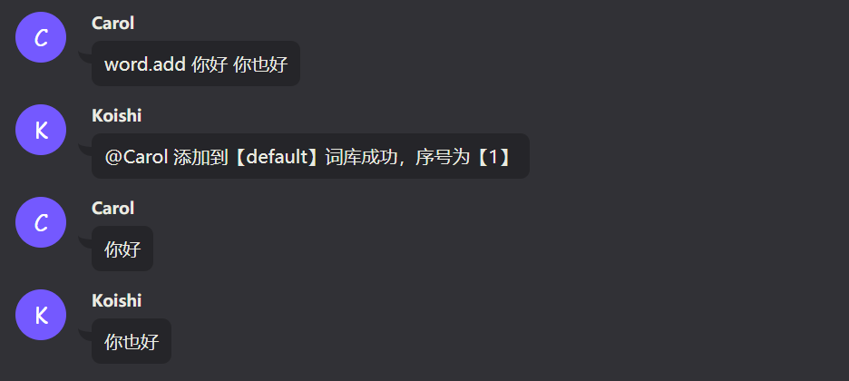
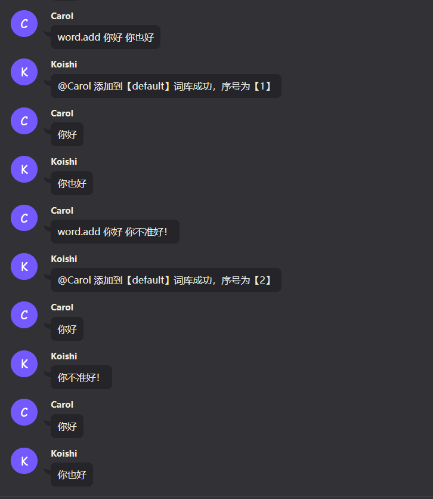
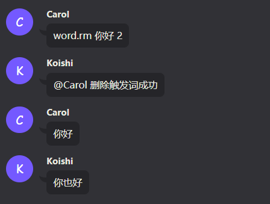
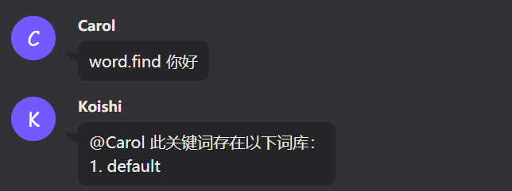
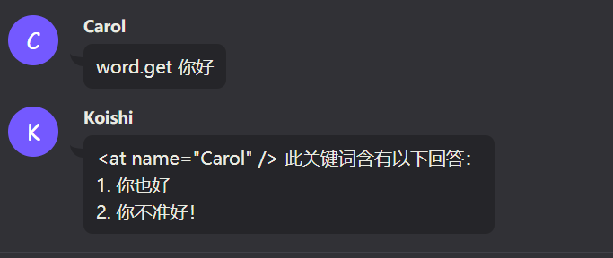

# 词库主插件入门

# 简介 & 入门须知

word-core词库插件，是一个编辑机器人问答的插件。

问：我们称作`触发句`

答：我们称为`回复句`

下方的<>代表命令的必填参数，\[ \] 代表可选参数，

假如，我们需要机器人，在检测到我们发送"测试"后，发送"测试成功"，只需要发送这样的指令：

```
word.add 测试 测试成功
```

当命令中有`参数项`需要有`空格`或者`特殊的符号`的时候，需要将触发句或者回复句前后加上`"`符号，比如：

```
word.add "g i a o!" "好好好...是是是"
```

另外，词库的触发词支持正则语句，触发词的正则会在开头自动加上^，在结尾自动加上$

# 添加删除词库相关

## 注意事项

在`成功添加问答`后，词库才会在数据库内生成真正的存储数据结构，只有在`有`存储数据结构的时候，才可以进行`作者`和`存储格`的修改

## 如何添加词库

添加词库的语法是这样的：

```html
word.add <触发句> <回复句>
```

当我们想要达到如下的情景的时候：说出`你好`后，让机器人回复`你也好`

我们仅需要输入如下指令：

```
word.add 你好 你也好
```

此时：



### 关于多个回答：

同一个`触发句`，可以添加多个`回复句`，当有人发送`触发句`的时候，词库会随机抽取一条`回复句`回复



## 如何删除词库

我们在上面添加词库的章节中，看到了每次添加都会有`序号`的出现，删除一条`回复句`很简单：

```html
word.rm <触发句> <序号>
```

比如我们需要删除上述章节添加的`你不准好！`那个回复，只需要这么做：

```
word.rm 你好 2
```



## 设置编辑的词库

词库拥有多个存储库，你编辑的每条词库默认存储在`default`词库，我们也可以通过指令，来设置需要编辑的词库

```html
word.setedit [库名]
```

库名为空时，表示编辑`default`库。

使用如下命令可以编辑名为`测试`的库：

```
word.setedit 测试
```

可以设置到不存在的词库，添加问答的时候，会自动新建库。

## 查看当前正在编辑的库

当我们不知道当前正在编辑哪个词库的时候，可以使用如下命令查看

```
word.readedit
```

## 寻找某个触发句所在的库

当我们忘记某个触发词在哪个库的时候，可以使用此命令查找：

```html
word.find <触发句>
```

比如我们忘记`你好`在哪个词库的时候：

```
word.find 你好
```



## 查看当前库某触发句的所有回复句

当我们忘记某`回复句`的序号，或需要查看当前编辑的词库的某触发词下的所有`回复句`的时候，可以使用如下指令：

```html
word.get <触发句>
```

比如如下的使用方法：



## 查看当前库所拥有的所有触发句

我们可以使用如下指令查看当前编辑的库下的所有触发句：

```
word.getDB
```

# 玩家数据相关

## 基础概念

### 背包

每个词库的触发者都会建立一个`背包`，`背包`是用来存储用户数据的，背包内包含若干个`存储格`

### 存储格

`存储格`是用来存储某个库产生的数据的。

词库的每个`库`都可以设置一个`存储格`，库默认的存储格为`default`。

当`库`需要读取或者写入用户数据的时候，会读取背包内对应的`存储格`

这样可以做到每个库的物品是否隔离，比如当你创建了一个文字游戏的库，叫做`功夫1`

此时你设置它的`存储格`为`"功夫系列"`

等后续你开发第二部`功夫2`的时候，你也将它的`存储格`设置为`"功夫系列"`

此时，两个词库共用一个存储格，物品可以共享。

而如果此时还有个`武林`库，设置存储格为`"武林系列"`那此时，这个存储格和`功夫系列`的存储格子是隔离的，不互通的

## 设置当前库的存储格

我们可以使用如下命令设置当前编辑的库的存储格：

```html
// 设置存储格
word.setsave <存储格>

// 恢复为默认存储格
word.resetsave
```

比如：

```
word.setsave 武林系列
```

## 查看当前库的存储格

我们可以使用如下命令来查看当前编辑的库的存储格是什么：

```
word.getsave
```

# 权限相关

## 基础概念

### 作者

每个词库在成功创建后，会将第一个为其添加词库的人设置为作者，后续此库仅允许作者添加，即使你拥有管理员权限也无权修改作者不为你的库。

每个库的作者，可以添加别的用户id来将其加入到此库的作者列中，从而一起编辑

### 权限

词库的每个库（即使是需要新建的库）都拥有自己的权限节点，编辑者需要满足权限才可以进行编辑。词库管理员级权限默认拥有词库的编辑权，但即使拥有编辑权的时候，还是需要判断你是否为词库作者。

```
权限节点说明：
编辑词库：word.edit.词库名
编辑所有词库：word.edit.*
为某人添加权限：word.admin.add
为某人删除权限：word.admin.rm
管理员级权限：word.admin.*
```

### 编辑词库的权限

当你需要编辑`你好`这个库，你需要

1. 权限：word.edit.你好
2. 并且你为词库作者

### 设置别人为词库管理员

赋予对方`word.admin.*`权限

## 为某人添加权限

```html
word.addp <用户id> <权限节点>
```

比如你需要给用户id为`5b0fe8a3b1ff2`的用户添加一个`word.edit.*`的权限：

```
word.addp 5b0fe8a3b1ff2 word.edit.*
```

## 删除某人的权限

```html
word.rmp <用户id> <权限节点>
```

比如你需要删除用户id为`5b0fe8a3b1ff2`的用户的`word.edit.*`的权限：

```
word.rmp 5b0fe8a3b1ff2 word.edit.*
```

## 新增某人为当前库作者

```html
word.addauthor <用户id>
```

比如你需要添加id为`5b0fe8a3b1ff2`的用户为当前你正在编辑的词库的作者

```
word.addauthor 5b0fe8a3b1ff2
```

## 取消某人为当前库作者

```
word.rmauthor <用户id>
```

比如你需要取消id为`5b0fe8a3b1ff2`的用户为当前你正在编辑的词库的作者

```
word.rmauthor 5b0fe8a3b1ff2
```

# 其他工具

## 查看自己的id及名字

```
word.id
```
